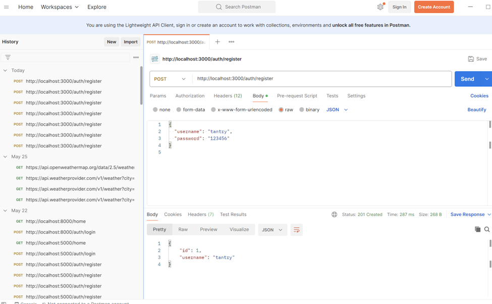
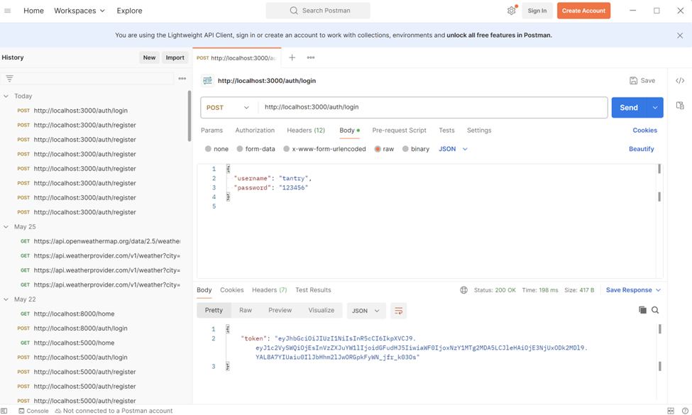
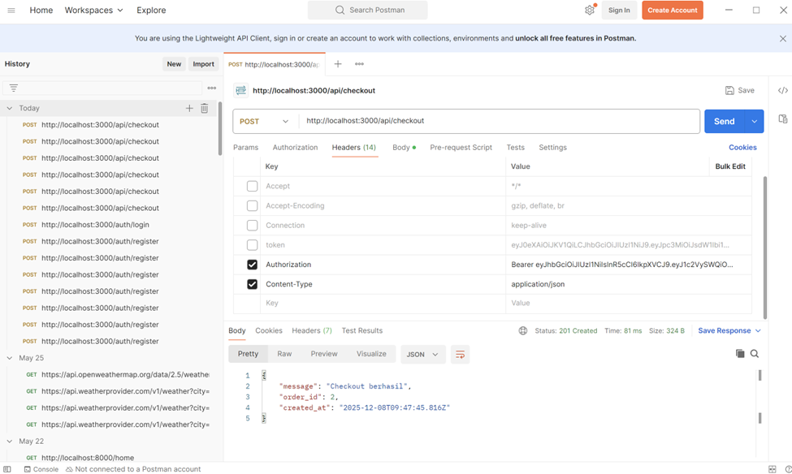
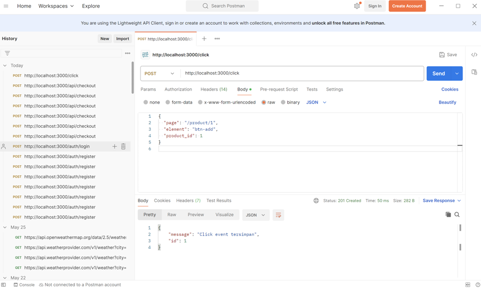
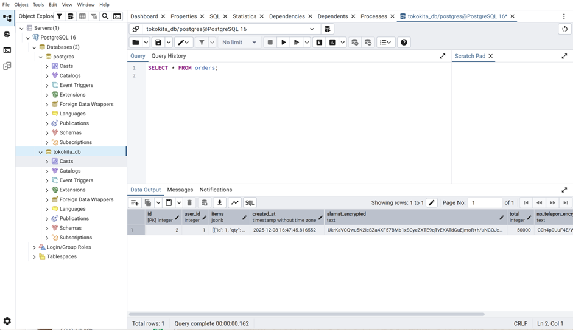
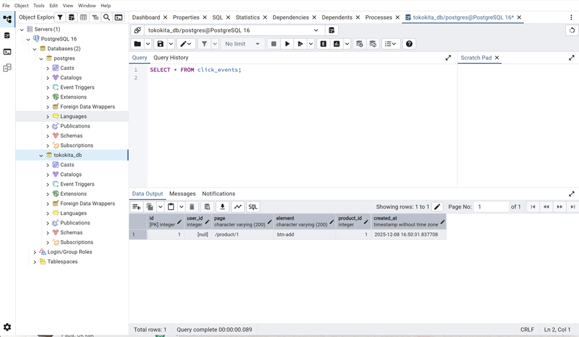

# TokoKita – Secure E-Commerce Backend

Backend sederhana untuk aplikasi e-commerce **TokoKita** dengan fokus pada keamanan:

- Login & register dengan **JWT**
- Password disimpan dalam bentuk **hash (bcrypt)**
- Data sensitif (alamat & nomor telepon) disimpan **terenkripsi** di PostgreSQL
- Pencatatan **checkout** dan **click event** untuk analitik

---

## 1. Tech Stack

- Node.js + Express
- PostgreSQL
- JWT (JSON Web Token)
- bcrypt untuk hash password
- Crypto (AES) untuk enkripsi data sensitif
- pg (node-postgres) sebagai driver DB

---

## 2. Cara Menjalankan

### 2.1 Clone repo & install dependency

```bash
git clone https://github.com/agestsia/TokoKita.git
cd TokoKita
npm install
````

### 2.2 Buat role & database PostgreSQL (contoh)

```sql
CREATE ROLE tokokita WITH LOGIN PASSWORD 'secret';
CREATE DATABASE tokokita_db OWNER tokokita;
```

### 2.3 Buat tabel utama di database

Secara garis besar ada tiga tabel utama:

* `users` – menyimpan user dan `password_hash`
* `orders` – menyimpan data checkout (alamat & nomor telepon terenkripsi)
* `click_events` – menyimpan jejak klik user (page, element, product_id)

> Catatan: definisi detail tabel sudah dibuat langsung di pgAdmin saat demo.

### 2.4 Buat file `.env` di root project

```env
PORT=3000

DB_HOST=localhost
DB_PORT=5432
DB_USER=tokokita
DB_PASSWORD=secret
DB_NAME=tokokita_db

JWT_SECRET=jwt_rahasia_banget
DB_ENCRYPTION_KEY=tokokita_encrypt_2025
```

### 2.5 Jalankan server

```bash
npm run dev
```

Jika berhasil, di terminal akan muncul:

```text
Server berjalan di port 3000
```

### 2.6 Tes cepat di browser / Postman

```http
GET http://localhost:3000/
```

Response:

```json
{ "message": "TokoKita backend up & running" }
```

---

## 3. Endpoint & Contoh Pemakaian

### 3.1 POST `/auth/register`

Register user baru.

Contoh request (JSON):

```json
{
  "username": "admin",
  "password": "admin123"
}
```

Password akan di-hash (`bcrypt`) sebelum disimpan ke tabel `users`.

---

### 3.2 POST `/auth/login`

Login dan mendapatkan JWT.

Request:

```json
{
  "username": "admin",
  "password": "admin123"
}
```

Response:

```json
{
  "token": "eyJhbGciOiJIUzI1NiIsInR5cCI6IkpXVCJ9..."
}
```

Token ini dipakai sebagai header:

```http
Authorization: Bearer <token>
```

---

### 3.3 GET `/me`

Endpoint proteksi JWT, hanya bisa diakses jika header `Authorization` berisi token yang valid.

Contoh response:

```json
{
  "message": "Profil user dari token",
  "user": {
    "userId": 1,
    "username": "admin",
    "iat": 1731234567,
    "exp": 1731240000
  }
}
```

---

### 3.4 POST `/api/checkout`

Mencatat transaksi checkout + menyimpan data sensitif secara terenkripsi di DB.

Request body:

```json
{
  "items": "Sepatu x2",
  "alamat": "Jl. Contoh No. 1",
  "no_telepon": "08123456789",
  "total": 300000
}
```

* `alamat` dan `no_telepon` akan dienkripsi dengan `DB_ENCRYPTION_KEY`
* Data disimpan ke tabel `orders`

Response (contoh):

```json
{
  "message": "Checkout berhasil",
  "order_id": 4,
  "created_at": "2025-12-08T12:07:44.942Z"
}
```

---

### 3.5 POST `/api/click`

Mencatat click event untuk analitik.

Request body:

```json
{
  "page": "/home",
  "element": "buy_button",
  "product_id": 1
}
```

Disimpan ke tabel `click_events` dengan kolom:

* `user_id` (jika pakai JWT + middleware)
* `page`
* `element`
* `product_id`
* `clicked_at`

Response:

```json
{
  "message": "Click event tersimpan",
  "id": 2
}
```

---

## 4. Bukti Keamanan (Demo Screenshot)

Berikut langkah-langkah pengujian yang sudah dilakukan:

### 4.1 Test register



### 4.2 Test login untuk dapat token



### 4.3 Test endpoint checkout



### 4.4 Test endpoint click



### 4.5 Cek di database

* Cek tabel `orders` (alamat & nomor telepon sudah dalam bentuk terenkripsi)

  

* Cek tabel `click_events`

  
